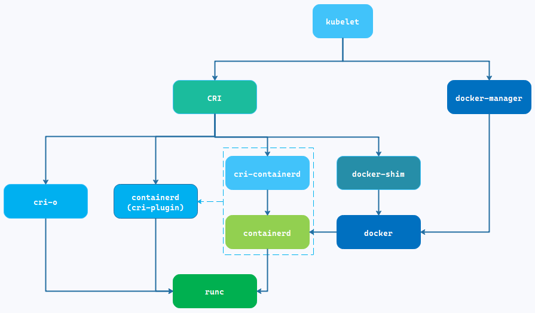

话说前一段时间，各个自媒体都在说`k8s` 要弃用`docker`了。其实 `k8s `弃用的是 `Dockershim` ,什么是 `Dockershim` ，这就得简单说下：`Kubernetes`、`Docker`、`Containerd`三者之间的关系了。

# 容器（Container）

首先说的是==container==容器。随着docker的大热，docker的经典图标，一条鲸鱼拖着若干个集装箱的经典形象已经深入人心。container并不是docker出现了才有的，而在之前，linux container就已经翻译为linux容器并被大家接受。而从含义来看，一开始选定把“容器”作为container的翻译，也应该是准确的。而随着docker出现，container的概念深入人心，而其与原来的linux container中的container，含义应该说是一致的。

那么何为容器？容器本质上是受到资源限制，彼此间相互隔离的若干个linux进程的集合。这是有别于基于模拟的虚拟机的。一般来说，容器技术主要指代用于资源限制的cgroup，用于隔离的namespace，以及基础的linux kernel等。

# k8s 和docker 的恩怨纠葛

13年 docker 项目开源后几个月的时间就迅速崛起了，速度之快让Cloud Foundry 和 所有的PaaS 社区都还没反应过来，就宣告出局了。其实他们的原理都是一样的，只是docker 项目有一个小小的创新----就是 docker 镜像。真正解决了打包问题，使其具有极其宝贵的能力：本地环境和云端环境的高度一致。然后一众公司开始了推出了 基于 docker 的容器集群管理项目，开启了`docker` 的时代。一时间 "容器化" 成了基础设施领域最炙手可热的关键词。一个以==容器== 为中心的全新云计算市场呼之欲出。

而此时这个生态的缔造者 dotCloud  公司突然改名为 Docker 公司。这个举动，在当时颇受质疑。在大家印象中，Docker 只是一个开源项目的名字。可是现在，这个单词却成了 Docker 公司的注册商标，任何人在商业活动中使用这个单词，以及鲸鱼的 Logo，都会立刻受到法律警告。这还是"小事儿"，之后 在14年年底，Docker 公司对外发布了自家的 "原生的" 容器集群管理项目 Swarm。

没错，Docker 项目从发布之初就全面发力，从技术、社区、商业、市场全方位争取到的开发者群体，实际上是为此后吸引整个生态到自家“PaaS”上的一个铺垫。只不过这时，“PaaS”的定义已经全然不是 Cloud Foundry 描述的那个样子，而是变成了一套以 Docker 容器为技术核心，以 Docker 镜像为打包标准的、全新的“容器化”思路。而 Swarm 项目，正是接下来承接 Docker 公司所有这些努力的关键所在

docker公司不满足 Docker 项目的定位，围绕着 docker 在各个层次进行集成和创新的项目层出不穷，一时之间，整个后端和云计算领域的聪明才俊都汇集在了这个“小鲸鱼”的周围，为 Docker 生态的蓬勃发展献上了自己的智慧。这段时间，也正是 Docker 生态创业公司们的春天，大量围绕着 Docker 项目的网络、存储、监控、CI/CD，甚至 UI 项目纷纷出台。

事实上，很多从业者也都看得明白，Docker 项目此时已经成为 Docker 公司一个商业产品。而开源，只是 Docker 公司吸引开发者群体的一个重要手段。不过这么多年来，开源社区的商业化其实都是类似的思路，而真正令大多数人不满意的是，Docker 公司在 Docker 开源项目的发展上，始终保持着绝对的权威和发言权，并在多个场合用实际行动挑战到了其他玩家（比如，CoreOS、RedHat，甚至谷歌和微软）的切身利益。

很多人都不知道，其实在docker 项目刚刚兴起的时候，google 也开源了一个linux容器项目,然而，面对docker 项目的强势崛起，google 这个项目根本没有招架之力，所以google 知难而退，向Docker 公司伸出了橄榄枝：关停这个项目和Docker 公司共同推出一个中立的容器运行时库，作为Docker 项目的核心依赖。

不过，Docker 公司并没有认同这个明显会削弱自己地位的提议，还在不久后，自己发布了一个容器运行时库 Libcontainer。这次匆忙的、由一家主导的、并带有战略性考量的重构，成了 Libcontainer 被社区长期诟病代码可读性差、可维护性不强的一个重要原因。

至此，Docker 公司在容器运行时层面上的强硬态度，以及 Docker 项目在高速迭代中表现出来的不稳定和频繁变更的问题，开始让社区叫苦不迭，容器领域的其他几位玩家开始商议“切割”Docker 项目的话语权。而“切割”的手段也非常经典，那就是成立一个中立的基金会。于是，2015 年 6 月 22 日，由 Docker 公司牵头，CoreOS、Google、RedHat 等公司共同宣布，Docker 公司将 Libcontainer 捐出，并改名为 RunC 项目，交由一个完全中立的基金会管理，然后以 RunC 为依据，大家共同制定一套容器和镜像的标准和规范。这套标准和规范，就是 OCI（ Open Container Initiative ）。OCI 的提出，意在将容器运行时和镜像的实现从 Docker 项目中完全剥离出来。这样做，一方面可以改善 Docker 公司在容器技术上一家独大的现状，另一方面也为其他玩家不依赖于 Docker 项目构建各自的平台层能力提供了可能。

  眼看着 OCI 并没能改变 Docker 公司在容器领域一家独大的现状，Google 和 RedHat 等公司于是把与第二把武器摆上了台面。所以这次，Google、RedHat 等开源基础设施领域玩家们，共同牵头发起了一个名为 CNCF（Cloud Native Computing Foundation）的基金会。这个基金会的目的其实很容易理解：它希望，以 Kubernetes 项目为基础，建立一个由开源基础设施领域厂商主导的、按照独立基金会方式运营的平台级社区，来对抗以 Docker 公司为核心的容器商业生态。而为了打造出这样一条围绕 Kubernetes 项目的“护城河”，CNCF 社区就需要至少确保两件事情：

- Kubernetes 项目必须能够在容器编排领域取得足够大的竞争优势；

- CNCF 社区必须以 Kubernetes 项目为核心，覆盖足够多的场景。

这次竞争的发展态势，很快就超过了 Docker 公司的预期, Kubernetes 项目让人耳目一新的设计理念和号召力，很快就构建出了一个与众不同的容器编排与管理的生态。Kubernetes 项目在 GitHub 上的各项指标开始一骑绝尘，将 Swarm 项目远远地甩在了身后。

`docker`公司后来面对k8s的崛起和壮大，docker 自知已无力回天，先是将`containerd`捐赠给了`CNCF`，后来把 Docker 项目改名为 Moby，然后交给社区自行维护。

# `Docker`、`OCI` 和 `Containerd`

>  `OCI`主要包含两个规范，一个是容器运行时规范(runtime-spec)，一个是容器镜像规范(image-spec)。
>
>  -   `runc`是什么?`runc`是一个轻量级的命令行工具，可以用它来运行容器。`runc`遵循`OCI`标准来创建和运行容器，它算是第一个`OCI Runtime`标准的参考实现。
>  -   `containerd`是什么？`containerd`的自我介绍中说它是一个开放、可靠的容器运行时，实际上它包含了单机运行一个容器运行时的功能。

`containerd`为了支持多种`OCI Runtime`实现，内部使用`containerd-shim`，`shim`英文翻译过来是"垫片"的意思，见名知义了，例如为了支持`runc`，就提供了`containerd-shim-runc`。

经过上面的发展，docker启动一个容器的过程大致是下图所示的流程:

从上图可以看出，每启动一个容器，实际上是`containerd`启动了一个`containerd-shim-runc`进程，即使`containerd`的挂掉也不会影响到已经启动的容器。

# `Kubernetes`、`Docker`、`Containerd` 和`CRI`

上面的故事也看出来了 `kubernetes`的出现是为了解决容器编排的问题，在早期为了支持多个容器引擎，是在Kubernetes内部对多个容器引擎做兼容，例如kubelet启动一个`docker-manager`的进程直接调用`docker`的 api 进行容器的创建

 

后来 k8s 为了隔离各个容器引擎之间的差异，在 `docker` 分离出 `containerd` 之后，k8s 也搞了一个自己的容器运行时接口，就是 `CRI` 的出现是为了统一 k8s 与不同容器引擎之间交互的接口，与 OCI 的容器运行时规范不同，CRI 更加适合k8s,。后面 k8s 开始把 containerd 接入 CRI 标准。

开始是 kubelet 通过 CRI 接口调用 `docker-shim` 进一步调用 docker 的API ，此时k8s 节点上kubelet 启动容器的过程大概如下图所示：

 

前面说了 Docker 项目越来越重，把许多周边的功能都集成到 docker Engine 中, 对于k8s 只是需要一个容器运行时，所以为了更好的将 containerd 接入到 CRI 标准中，k8s 又搞出一个 `cri-containerd` 的项目，`cri-containerd` 是一个守护进程用来实现`kubelet` 和 `containerd` 之间的交互，此时 k8s 节点 上 kubelet 启动容器的大概过程如下图：

 

上面`cri-containerd` 和 `containerd` 还是独立的两个进程。他们之间通过 `gRPC` 通信，为了进一步减少了调用链，提高运行效率，后来在 `containerd` V1.1 时，将`cri-containerd` 改成了 `containerd` 的 `CRI` 插件，这让 k8s 启动 容器的过程更加高效，此时k8s 节点上kubelet 启动容器的流程大概如下：

 

为了更加 贴近 `CRI` ，以RedHat 为首的大佬又搞了一个更加轻量的容器运行时: `cri-o`, 不依赖 `containerd` ，风格极简，可以说它的设计就是为了纯CRI 运行时而存在的。

目前 `CRI-O` 时 `CNCF` 的一个孵化项目。

k8s 抛弃 `docker-shim` 后，我们可以选择的容器运行时有`containerd` 和 `cri-o`.

k8s 调用链示意图：

 

